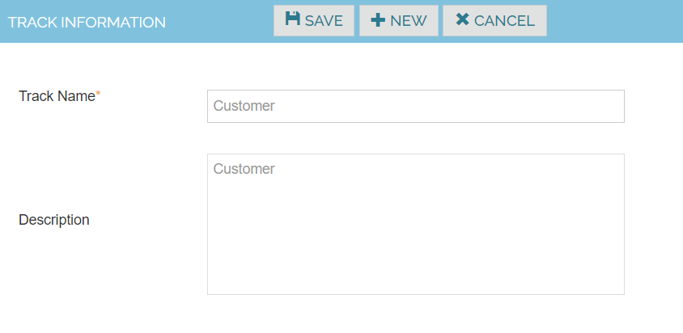

# Track

Create Tracks to categorize the Test Functions

1. Navigate to Configuration -> Tracks
2. Click Create New Track.
3. Enter New Track name and Track description.
4. Click Save button.

Actions

| Track Name    | Customer |
|---------------|----------|
| Description   | Customer |

